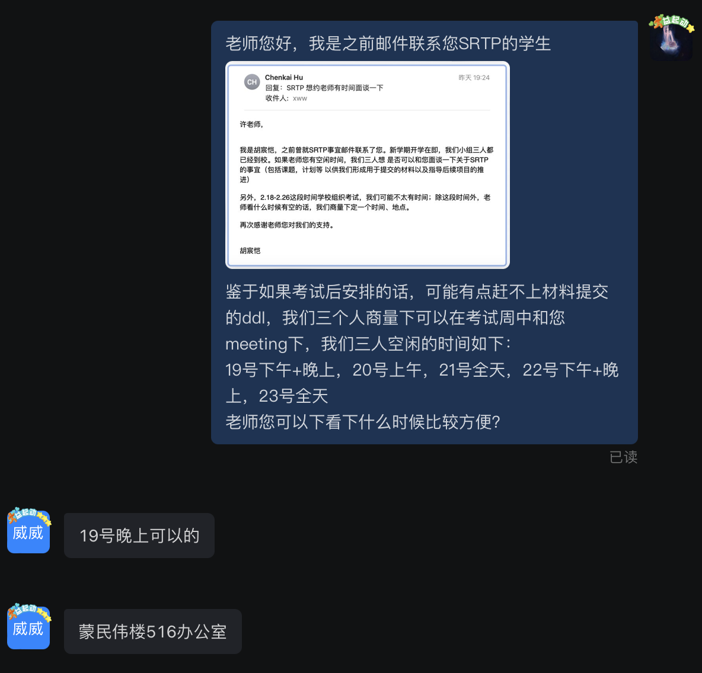
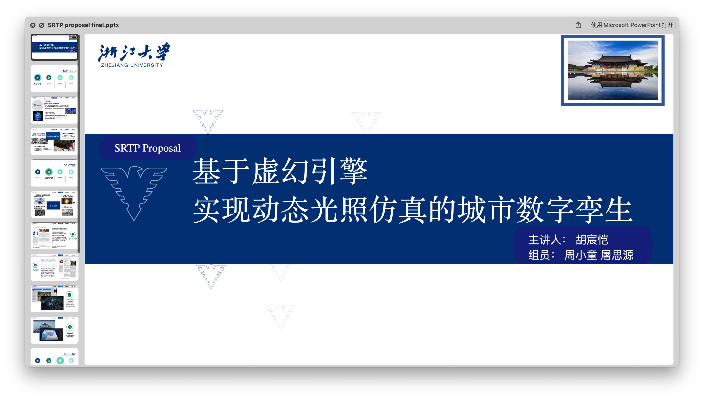

# 2.15

群组建立，正式开始讨论立项课题的选择，开始寻找指导老师。

# 2.16

与许威威老师取得联系，约定初次面谈时间。

老师提出建议"**做数字城市孪生，用unreal引擎来做，应用于自动驾驶仿真、游戏和地理信息系统**"

相关的链接 

- [Cesium for Unreal](https://www.unrealengine.com/marketplace/zh-CN/product/87b0d05800a545d49bf858ef3458c4f7)
  Cesium for Unreal借助基于真实世界的3D内容以及高精度的真实比例地球解锁虚幻引擎的3D地理空间生态系统。
- [Street Map Plugin for Unreal Engine](https://github.com/ue4plugins/StreetMap)
  这个插件允许你导入OpenStreetMap XML数据到你的虚幻引擎项目作为一个新的StreetMap资产类型。您可以使用示例街道地图组件来渲染街道和建筑物。
- [UE加载osgb倾斜摄影数据](https://blog.csdn.net/u014805066/article/details/120285653?spm=1001.2101.3001.6650.2&utm_medium=distribute.pc_relevant.none-task-blog-2%7Edefault%7ECTRLIST%7ERate-2-120285653-blog-126760921.pc_relevant_3mothn_strategy_and_data_recovery&depth_1-utm_source=distribute.pc_relevant.none-task-blog-2%7Edefault%7ECTRLIST%7ERate-2-120285653-blog-126760921.pc_relevant_3mothn_strategy_and_data_recovery&utm_relevant_index=5)
  支持加载大疆智图和CC导出的osgb格式倾斜摄影数据；支持编辑器模式（不运行）加载预览特定精度级别的osgb数据等

老师原话：“**SRTP就是要做一个支持动态光照仿真的数字城市挛生**”

# 2.19

和老师第一次面谈，初步确定了选题: **基于虚幻引擎实现动态光照仿真的城市数字孪生**。除此之外，还谈到一些可能可以使用的开源工具，以及未来一年研究的规划。

- [UrbanScene3D](https://github.com/yilinliu77/UrbanScene3D)
- [World creator](https://www.world-creator.com/)

# 3.15

立项平台系统截止接受申请。

# 3.20

初版立项答辩PPT出炉。Github建立仓库。

创新性的挖掘：结合动态光照的数字孪生；辅助城市规划。

(**孪生区别于普通三维重建的特点:**  数字孪生不仅可以重建静态场景，还可以模拟和预测物体在不同环境和条件下的行为和反应，以及进行虚拟实验和优化设计等。)

# 3.24

项目立项答辩 + 老师指导。

老师提出“本征图像分解、重光照技术作为创新点”

本征图像分解是一个难度比较大的技术，建议在项目后期完成。

完成答辩。

# 4.3

立项结果揭榜: 国创。

# 4.13

老师指派了一名博士生 (裴鑫铭学长) 指导辅助我们后续的工作。
