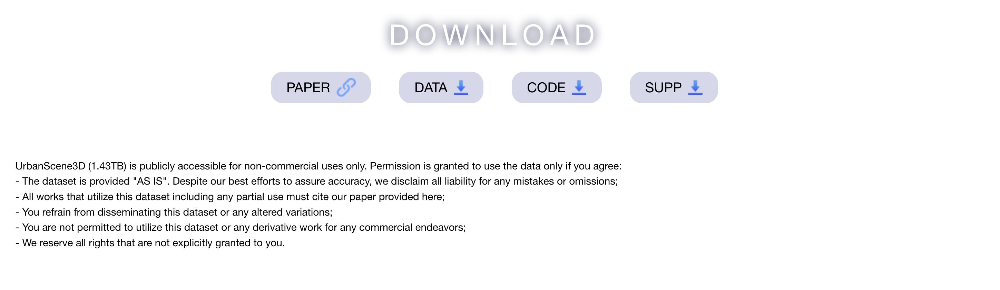
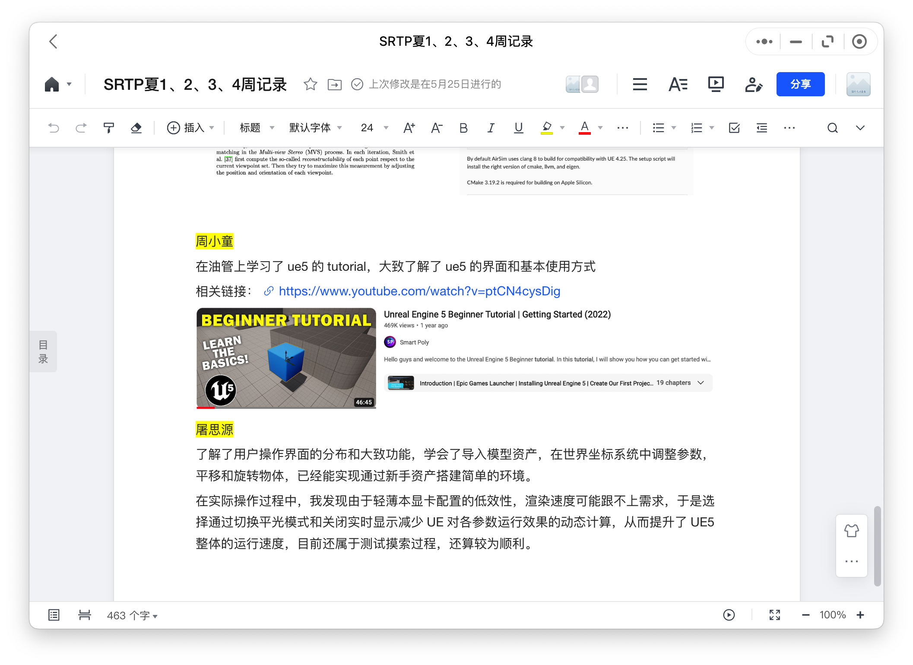

# 4.13

组内队员meeting，确认下阶段以及远景的规划。确认了购买或者租借无人机的计划。

# 4.18

第二次和许老师会面，也是立项成功后的第一次。许老师给的指导：

- unreal拿一个项目(如[UrbanScenen3D](https://vcc.tech/UrbanScene3D))先跑起来 熟悉支持的数据格式，和操作的管线
- 绘制帧率的影响因素的研究，提速（帧/s） 
- 了解虚幻引擎对LOD的支持，LOD构建模型的切换 （针对可能形成的跳变和切换）如何实现连续变换的层级
- 改光照
- 驾驶模拟器或者飞行模拟
- 产出可以是：系统、专利、论文。

基于unreal engine 5并结合使用UrbanScene3D、superMap以及world creator 等开源工具或者插件，来实现实时动态关照模拟的数字城市孪生。 在拥有动态光照 模拟的小型城市地理区域范围内，⻆色可以自由移动空间位置和视⻆，观察建筑和景观。进阶地，可以实现时间流逝的速度的调整，光照参数的调整，扫描和处理追求逼近真实。

>**UrbanScene 3D Abstract**
>
>我们提出了一个用于城市场景感知与重建研究的大规模数据平台UrbanScene3D。UrbanScene3D包含超过128k的高分辨率图像，涵盖16个场景，包括大规模真实城市区域和总面积为136平方公里的合成城市。该数据集还包含高精度激光雷达扫描和数百个具有不同观测模式的图像集，为设计和评估空中路径规划和三维重建算法提供了一个全面的基准。此外，基于Unreal Engine和Airsim模拟器构建的数据集，以及数据集中每个建筑物的手动标注的唯一实例标签，可以生成各种数据，例如2D深度图、2D/3D边界框、3D点云/网格分割等。具有物理引擎和照明系统的模拟器不仅可以产生各种数据，还可以使用户在拟建的城市环境中模拟汽车和无人机，为未来的研究提供支持。

# 5.3 

开始跑[数据集](https://vcc.tech/UrbanScene3D)，发现硬件限制。

👉 7.26更新，购置海力士2T固态。电子发票已经发至邮箱。

👉 8.01更新，[深大VCC](https://vcc.tech/download.html)又发布新工作，[UrbanBIS  ECCV2023](https://vcc.tech/UrbanBIS)。

> **UrbanBIS 摘要:** 
>
> 本文提出了用于大规模三维城市理解的UrbanBIS基准，支持实用的城市级语义和建筑级实例分割。UrbanBIS包含6个真实的城市场景，25亿个点，覆盖10.78平方公里的广阔区域和3370栋建筑，通过113346次航空摄影测量捕捉到。特别地，UrbanBIS不仅提供了对大量城市对象(包括建筑物、车辆、植被、道路和桥梁)的语义级标注，还提供了对建筑物的实例级标注。此外，UrbanBIS是第一个引入细粒度建筑子类别的3D数据集，考虑了不同建筑类型的各种形状。此外，提出了一种基于B-Seg的建筑物实例分割方法，用于建立UrbanBIS模型。B-Seg采用端到端的框架，采用简单有效的策略处理大规模点云。与主流方法相比，B-Seg在UrbanBIS数据集上取得了更好的精度和更快的推理速度。UrbanBIS提供了高分辨率的航拍图像和高质量的大尺度三维重建模型，有助于开展多视图立体、城市LOD生成、航迹规划、自主导航、路网提取等研究，是许多智慧城市应用的重要平台。

# 5.25

完成第一阶段的组员汇报总结。内容整理在腾讯文档中，如下预览。[原文档链接](
https://docs.qq.com/doc/DZnJCc2pjY0lnRmRj)

